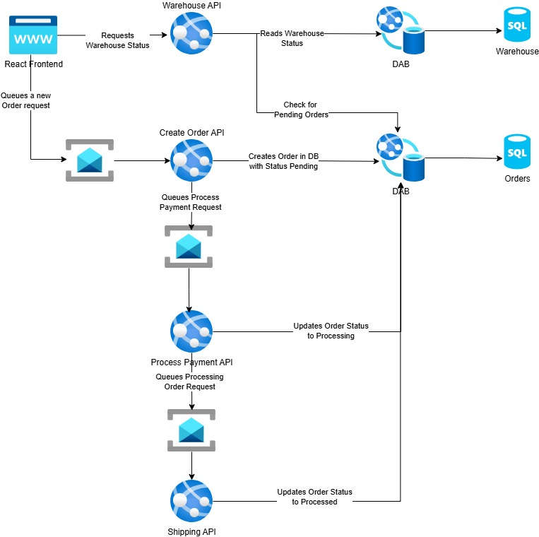

# .NET Aspire Book

This is the repo for the architecture developed in the .NET Aspire Book, written by Naga Santhosh Reddy Vootukuri and Tommaso Stocchi.

## Application Architecture

The application developed in this book is an e-shop leveraging a microservices architecture. The application is composed of the following services:

- **Frontend**: UI is Built using React
- **Warehouse API**: .NET - when a request is made to the warehouse API, it will read the warehouse status from the warehouse and the current pending orders from the order database. It will make sure to remove items coming from the pending orders from the available stock in the warehouse.
- **Create Order API**: golang - when a request is made to the create order API, it will create a new order in the order database and set it to pending.
- **Payment API**: python - when a request is made to the payment API, it will set the order status to processing.
- **Shipping API**: node.js - when a request is made to the shipping API, it will set the order status to completed.

The order processing queue implemented using **Create Order API**, **Payment API**, and **Shipping API** is implemented using a pub/sub architecture leveraging redis cache in local development and [Azure Service Bus](https://learn.microsoft.com/en-us/azure/service-bus-messaging/) during the deployment.

There are two databases:
- **Warehouse Database**: SQL - holds the data for the warehouse
- **Order Database**: SQL - holds the order history for pending, processing, and completed orders

The data layer to the databases is implemented using [Data API Builder](https://learn.microsoft.com/en-us/azure/data-api-builder/).

The architecture is described in the following diagram:

